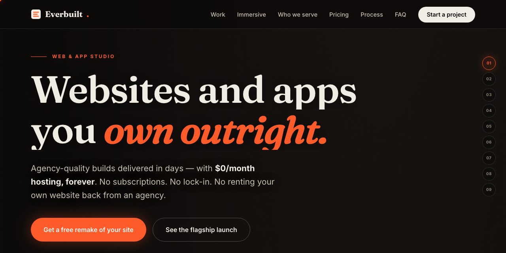

# Everbuilt Studio

Source for **everbuiltstudio.com**, the site of Everbuilt Studio: premium static websites clients own outright, hosted for $0 a month. The homepage is a scroll-morphing Three.js scene of ~160 instanced blocks reforming through six formations.

 

**Try it: https://everbuiltstudio.com**

## What it does

- Fully static: industry pages, guides and 60 city pages generated by `build_pages.py`
- Three.js hero, custom viewfinder cursor, no framework, no build step beyond the page generator
- Flagship client work: a national nonprofit tour site launched with zero downtime

## Run it

`python3 build_pages.py` regenerates the generated pages and the sitemap.

---

**If this is useful to you, a ⭐ on the repo helps other people find it.** Issues and pull requests are welcome.

Built by [Priyankar "Sunny" Chakraborty](https://github.com/suncal) · [everbuiltstudio.com](https://everbuiltstudio.com)
